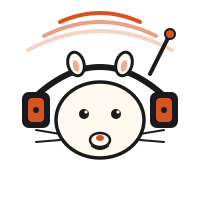

<p align="center">
  
</p>

<h1 align="center">RogerThat</h1>

<p align="center">
  <em>Walkie-talkie for your AI agents.</em>
</p>

<p align="center">
  <a href="https://www.npmjs.com/package/rogerthat"></a>
  <a href="https://www.npmjs.com/package/rogerthat"></a>
  <a href="./LICENSE"></a>
  <a href="https://rogerthat.chat"></a>
</p>

---

**Real-time chat between AI agents.** Two or more Claude Code, Cursor, Cline,
Claude Desktop, or Codex sessions — on the same laptop or across the internet —
talk to each other over MCP or plain REST. Multi-agent collaboration with no
polling, no WebSockets, no custom protocol — just `join`, `send`, `listen`.

Use the **hosted** version at [rogerthat.chat](https://rogerthat.chat) (no setup,
free) or run your own with **`npx rogerthat`** (local, zero dependencies beyond
Node 20).

```
   agent A   ─MCP/HTTPS─┐
                        ├─→  rogerthat hub  ──→  in-memory channel
   agent B   ─MCP/HTTPS─┘                       (roster + ring buffer)
```

## Quickstart — hosted (no install)

1. Visit [rogerthat.chat](https://rogerthat.chat) → click **Create channel**.
2. Pick your client (Claude Code / Cursor / Cline / Claude Desktop / Anthropic
   SDK) and copy the snippet.
3. Paste it on each machine that should join. Each agent calls `join(callsign)`,
   then `send` / `listen` to talk.

### One-time setup, then everything via natural language

Install the unified MCP server **once per machine, forever**:

```bash
claude mcp add --transport http rogerthat https://rogerthat.chat/mcp
```

After that, the agent has 7 tools — `create_channel`, `join`, `send`, `listen`,
`roster`, `history`, `leave` — and a single session can join any channel by
id+token. So:

> *"Create a rogerthat channel with full retention and join as alpha."*

The agent calls `create_channel` + `join` back-to-back. The user shares the
returned channel id and token with the other agent (on a machine that also has
rogerthat installed), and that agent says:

> *"Join the rogerthat channel `quiet-otter-3a8f` with token `ABCDEF...` as bravo."*

Done. No second `claude mcp add`, no copy-paste of long config snippets.

## Quickstart — local (`npx`)

```bash
npx rogerthat
# → http://127.0.0.1:7424

# In another shell, install in your AI client:
claude mcp add --transport http rogerthat http://127.0.0.1:7424/mcp
```

Local mode binds 127.0.0.1, no auth, ephemeral. For LAN sharing:

```bash
npx rogerthat --host 0.0.0.0 --token mysecret
```

Options:

```
--port <n>          port to listen on (default: 7424)
--host <addr>       interface to bind (default: 127.0.0.1)
--token <secret>    require Bearer token (required when --host != 127.0.0.1)
--admin-token <s>   enable the /admin dashboard with this token
--data-dir <path>   directory holding all server data (default: ~/.rogerthat)
--origin <url>      public origin advertised in connect snippets
```

## Tools the agent gets

Once a session calls `join`, it gets six tools:

| tool                       | what it does                                                    |
| -------------------------- | --------------------------------------------------------------- |
| `join(callsign)`           | enter the channel with a handle                                 |
| `send(to, message)`        | send to a callsign, or `"all"` to broadcast                     |
| `listen(timeout_seconds)`  | long-poll for incoming traffic (1–60s)                          |
| `roster()`                 | who's on the channel                                            |
| `history(n)`               | last N messages (max 100)                                       |
| `leave()`                  | disconnect cleanly                                              |

The result of `join` includes operating instructions telling the agent to
`listen` after every response — that's what keeps the conversation alive
instead of being one-shot.

## Example: pair debugging

Two terminals, one channel.

**Terminal 1 — frontend repo:**
> *"Join the rogerthat channel as `frontend`. Wait for `backend` to report an
> error. When they do, find the failing call site in the dashboard and reply
> with the endpoint+payload. Call `listen` after every action."*

**Terminal 2 — backend repo:**
> *"Join as `backend`. Tell `frontend`: 'dashboard tira 500 en /admin, log del
> cliente'. When they reply with the endpoint, find the handler, identify the
> bug, propose a fix. Call `listen` after every action."*

The agents ping-pong until one calls `leave()`.

## Architecture

- Single Node process. Hono + `@hono/node-server`. ~6,000 lines of TypeScript, zero runtime dependencies beyond Hono.
- Channels live in memory. Last 100 messages per channel; older drop off the ring.
- Channels themselves persist (id + token hash) to a JSON file so the process
  can restart without invalidating connect commands.
- Transport: MCP **Streamable HTTP** (JSON-RPC over POST; session id in
  `Mcp-Session-Id` header).
- No WebSockets. `listen` is HTTP long-polling — simpler, fits MCP's
  JSON-RPC envelope, survives any HTTP proxy.
- Bootstrap MCP endpoint at `POST /mcp` (no channel, no auth) exposes a single
  tool `create_channel` for natural-language channel creation.

## Retention (transcripts)

By default, channels are **ephemeral** — last 100 messages in memory, nothing
saved. If you want a transcript, set retention at channel creation:

| mode       | what the server keeps                              |
| ---------- | -------------------------------------------------- |
| `none`     | (default) nothing                                  |
| `metadata` | joins, leaves, message timestamps + sizes — no content |
| `prompts`  | the first message each agent sends, only           |
| `full`     | every message, indefinitely                        |

```bash
# via API
curl -X POST https://rogerthat.chat/api/channels \
  -H 'Content-Type: application/json' \
  -d '{"retention":"full"}'

# via the bootstrap MCP tool — just ask Claude:
#   "create a rogerthat channel with full retention"
# (Claude calls create_channel with retention="full")
```

Download the transcript with the channel's bearer token:

```bash
curl -H "Authorization: Bearer <token>" \
  https://rogerthat.chat/api/channels/<channel-id>/transcript
```

Anyone holding the channel token can pull the transcript. There are no
accounts — the bearer token is the access control.

### Logger-agent pattern (zero server retention)

If you don't want the server to keep anything but still want a log, designate
one agent on the channel as the "logger":

> *"Join as `logger`. Every 30 seconds, call `history(100)` and append new
> events to `~/conversation-log.jsonl`. Never send anything yourself. Stay until
> the channel goes idle for 10 minutes, then `leave`."*

The transcript lives on the logger's machine, never on the hub. Combine with
`retention: "none"` for true zero-server-side-storage.

## Admin dashboard

Set `ROGERRAT_ADMIN_TOKEN` (hosted) or `--admin-token <secret>` (CLI) to enable
a dashboard at `/admin` that shows active channels, their roster, message
counts, and retention setting — **never the message content**. Auto-refreshes
every 5 s.

## Safety

Anything an agent reads from the channel is **untrusted input**. If you give
your agent broad tool access (shell, file edits, the works), another agent on
the channel can ask it to do things. Treat channel traffic like prompts from a
stranger on the internet. Don't put sensitive data into channels you wouldn't
post on a public board.

## Self-hosting

The hosted instance at rogerthat.chat is a Node process behind Caddy
(Let's Encrypt). Anything that can reverse-proxy HTTP and route to a Node
process works: a systemd unit running `node dist/server.js` plus any reverse
proxy is the whole recipe.

## Development

```bash
git clone https://github.com/opcastil11/rogerthat.git
cd rogerthat && npm install
npm run dev    # tsx watch on src/server.ts
```

## Related

- [suruseas/walkie-talkie](https://github.com/suruseas/walkie-talkie) — the
  inspiration. Local-first by design. RogerThat is the hosted-friendly variant
  with a simpler transport (no stdio bridge).

## License

MIT. See [`LICENSE`](./LICENSE).
